# ProMan
A Project Manager app that has following features- Registration, Login, Forget Password, update User Profile. It uses Firestore for database. You can create boards in which you can create lists and add multiple cards. You can assign different members to the boards with a notification feature for the same. You can add due date to the cards and also assign members per cards. You can add different colour label to the cards.  The app contains drag and drop feature to re arrange cards. The app uses Material UI components.

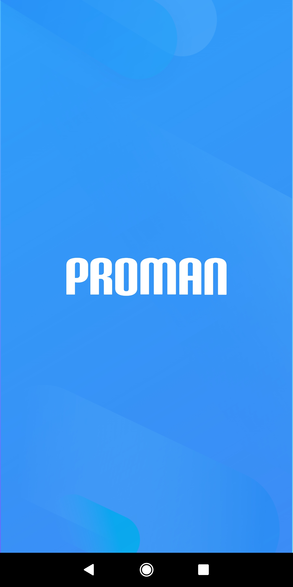 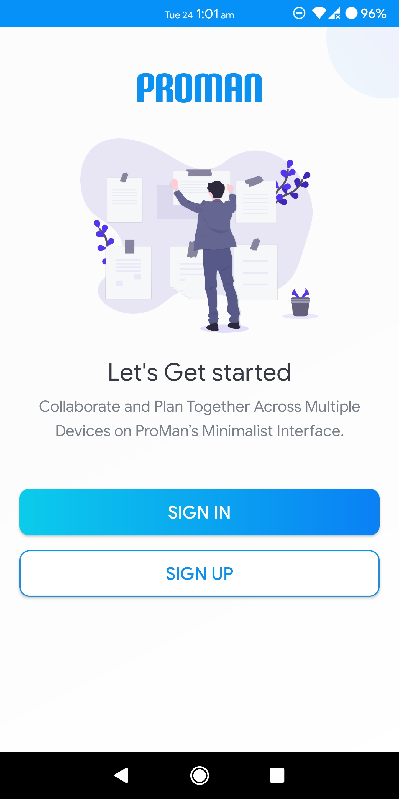

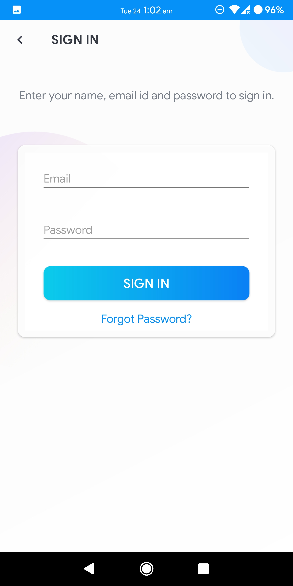 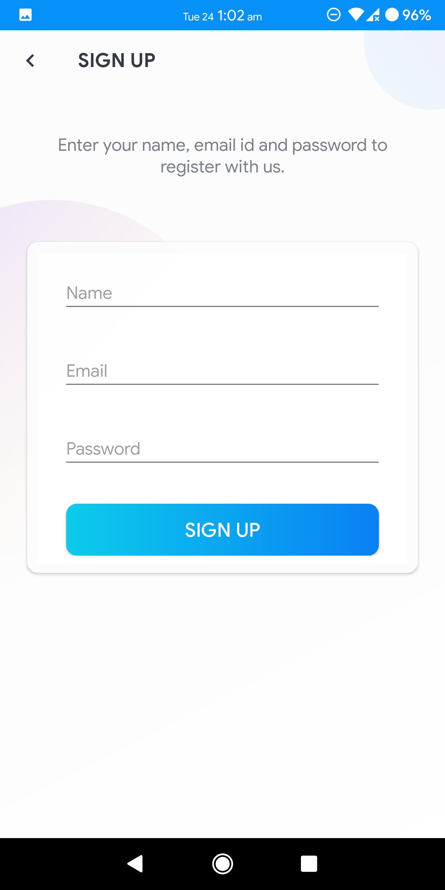

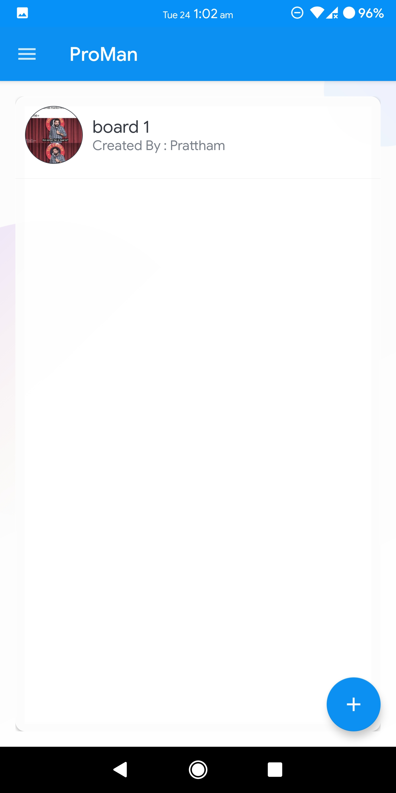 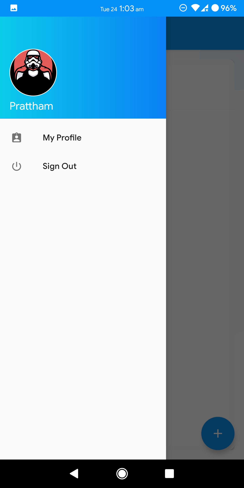

 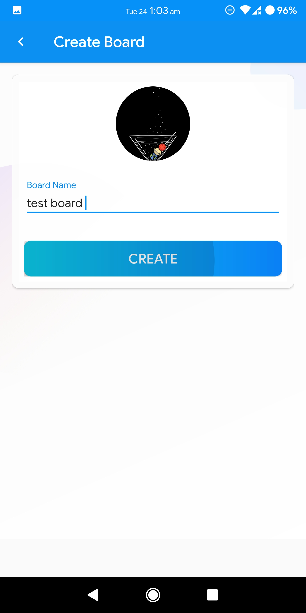

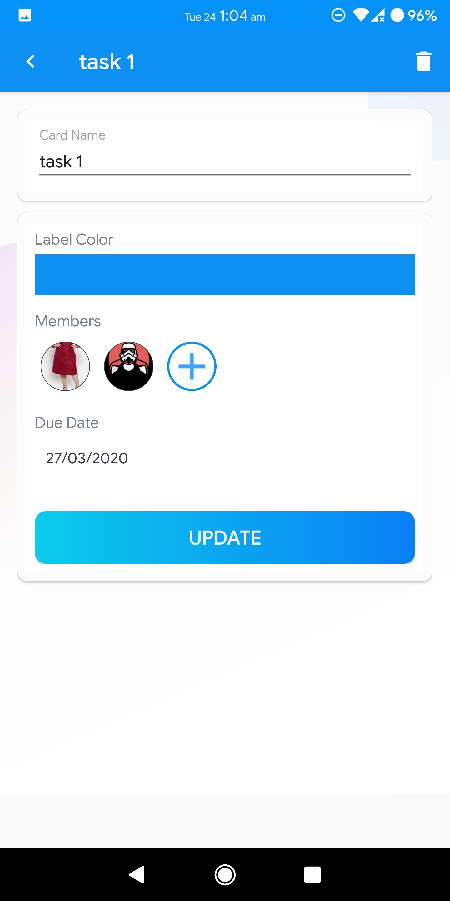 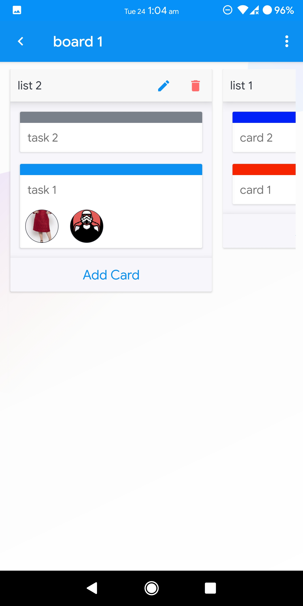

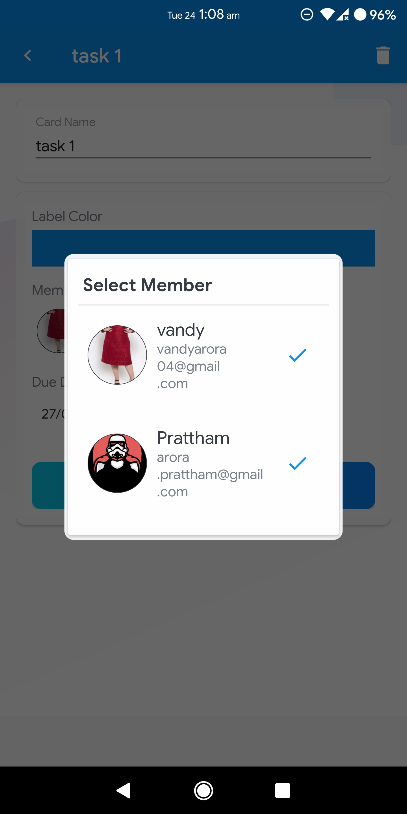 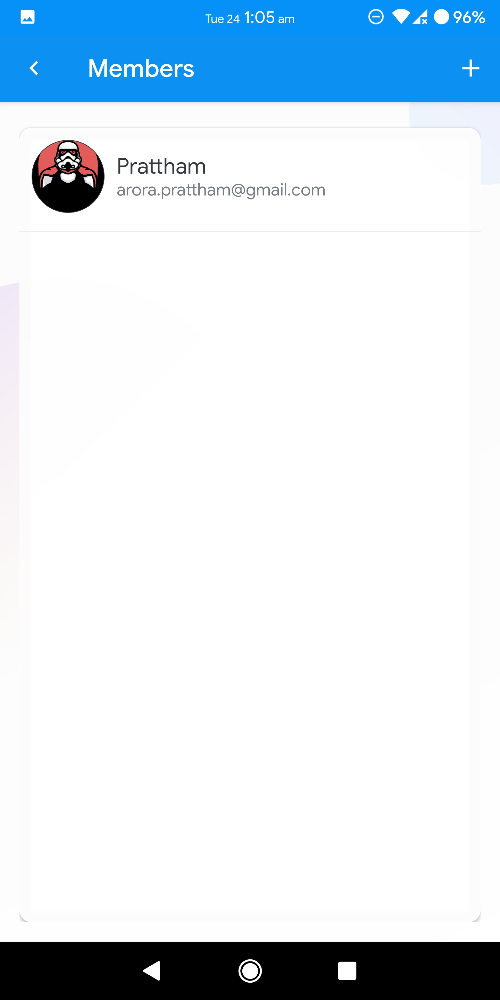
